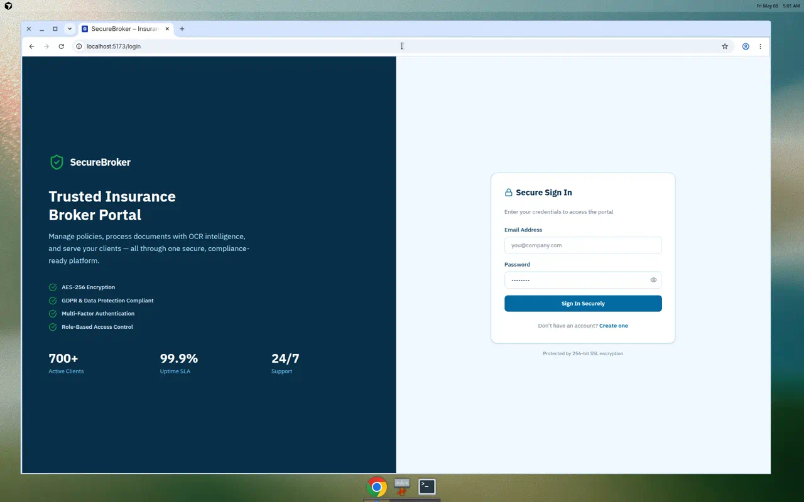
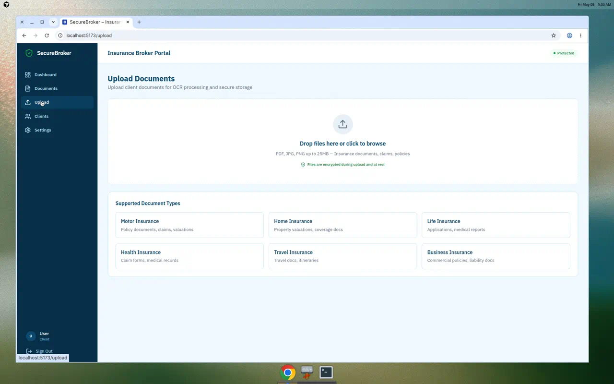

# Sindicom Brokers Ltd – Insurance Broker Portal

A modern insurance broker management platform built with React, TypeScript, and Supabase.

The **public homepage** at **`/`** is **one shared marketing entry** for everyone (clients, brokers, and admins). After sign-in, **role-specific** screens live under **`/dashboard/*`** (and optional separate **client vs staff** portal builds—see `frontend/.env.example` and `AGENTS.md`).

## Demo

### Screenshots

| Login | Dashboard | Documents |
|:---:|:---:|:---:|
|  |  |  |

| Upload | Clients | Settings |
|:---:|:---:|:---:|
|  |  |  |

### Screen recordings (MP4)

Short walkthrough clips in the repo (open or download from GitHub — use **Raw** if the player does not load):

| Recording | File |
|------------|------|
| Dashboard walkthrough | [`docs/demo/dashboard_walkthrough.mp4`](./docs/demo/dashboard_walkthrough.mp4) |
| Login flow | [`docs/demo/login_page_demo.mp4`](./docs/demo/login_page_demo.mp4) |
| UI redesign tour | [`docs/demo/redesigned_walkthrough.mp4`](./docs/demo/redesigned_walkthrough.mp4) |

**Tip:** On the repository page, browse to `docs/demo/`, click an `.mp4`, then use **Download** or **View raw** for playback outside the diff viewer.

## Live site (GitHub Pages + iPhone)

This repo deploys the **static frontend** to **GitHub Pages** on every push to `main` (workflow: **Deploy GitHub Pages**).

### One-time setup in GitHub

1. Open the repo on GitHub → **Settings** (repo settings, not your global account).
2. In the left sidebar, click **Pages**.
3. Under **Build and deployment**, set **Source** to **GitHub Actions** (not “Deploy from a branch”).
4. Go to the **Actions** tab → select **Deploy GitHub Pages** → **Run workflow** (or push a commit to `main`).
5. The first deploy may pause for **environment approval**: open the workflow run, click **Review deployments**, approve **github-pages** if GitHub asks.
6. When the job is green, **Pages** will show your URL (refresh the Pages settings page if needed).

**Site URL** (replace `<user>` with your GitHub username, lowercase in the host):

`https://<user>.github.io/website-insurance-broker/`

Example: `https://rihan-g.github.io/website-insurance-broker/`

### Demo login on Pages (no Supabase required)

The Pages build sets **`VITE_ALLOW_DEMO_LOGIN=true`**, so you can sign in with the **local demo accounts** shown on the login page (same emails/passwords as in `frontend/src/lib/demoAuth.ts`), for example:

- **Broker:** `broker@demo.sindicombrokers.local` / `BrokerDemo!SindicomBrokers`
- **Client:** `client@demo.sindicombrokers.local` / `ClientDemo!SindicomBrokers`
- **Admin:** `admin@demo.sindicombrokers.local` / `AdminDemo!SindicomBrokers`

Many screens use **mock data** when demo mode is active; any feature that still calls Supabase with real IDs may show empty data or errors until you add a real project and rebuild with `VITE_SUPABASE_URL` and `VITE_SUPABASE_ANON_KEY`.

### If something fails

- **404 on refresh:** the workflow copies `index.html` → `404.html`; redeploy from `main`.
- **Blank page or wrong assets:** confirm `VITE_GH_PAGES_BASE` matches the repo name (`/website-insurance-broker` for this repository). See **[docs/GITHUB_PAGES.md](docs/GITHUB_PAGES.md)** for base path case sensitivity and chunk-load errors.
- **Workflow not listed:** ensure `.github/workflows/deploy-github-pages.yml` exists on the default branch you push.

## Tech Stack

- **Frontend**: React 19 + TypeScript + Vite + Tailwind CSS v4
- **Backend**: Supabase (PostgreSQL, Auth, Storage, Edge Functions)
- **Testing**: Vitest + React Testing Library
- **Linting**: ESLint with TypeScript support

## Build planning

- **[PHASES.md](PHASES.md)** — Supabase / RLS rollout order (Phase 1–5).  
- **[docs/FEATURES_BY_PHASE.md](docs/FEATURES_BY_PHASE.md)** — which app features sit in which phase.  
- **[docs/GITHUB_PAGES.md](docs/GITHUB_PAGES.md)** — Pages URL, base path, demo login, and common CI/runtime errors.
- **[docs/CLOUDFLARE_PAGES.md](docs/CLOUDFLARE_PAGES.md)** — free Cloudflare Pages + Supabase production hosting (step-by-step).  
- **[docs/BUILD_ROADMAP.md](docs/BUILD_ROADMAP.md)** — execution sequencing for marketing depth, design system, quote persistence, SEO, and state management (complements product phases below).
- **[docs/FREE_TIER_STACK.md](docs/FREE_TIER_STACK.md)** — free-tier friendly stack (Vite, Vercel, Supabase, optional shadcn/Zustand/RHF, analytics, email) mapped to this repo.
- **[docs/next-migration/MIGRATION_STRATEGY.md](docs/next-migration/MIGRATION_STRATEGY.md)** — when and how to adopt Next.js, hosting tradeoffs (GitHub Pages vs Vercel), env vars, and App Router folder mapping.

## Getting Started

### Prerequisites

- Node.js 18+
- pnpm

### Install Dependencies

```bash
pnpm install
```

### Development

```bash
pnpm dev
```

Opens the dev server at [http://localhost:5173](http://localhost:5173).

### Build

```bash
pnpm build
```

### Test

```bash
pnpm test
```

### Lint

```bash
pnpm lint
```

## Project Structure

```
├── frontend/              # React frontend application
│   ├── src/
│   │   ├── components/    # Reusable UI components
│   │   ├── context/       # React context providers (Auth)
│   │   ├── layouts/       # Page layouts (AppLayout)
│   │   ├── lib/           # Supabase client, utilities
│   │   ├── pages/         # Page components
│   │   ├── test/          # Test setup and test files
│   │   └── types/         # TypeScript type definitions
│   └── public/            # Static assets
├── supabase/              # Supabase configuration
│   ├── config.toml        # Local dev config
│   └── migrations/        # Database migrations (SQL)
└── package.json           # Root workspace config
```

## Phases and features

**Engineering rollout (use this order for Supabase, RLS, and storage):** **[PHASES.md](PHASES.md)** — five phases from auth through hardening.

**What each phase includes in the UI (routes, tables, mock vs live):** **[docs/FEATURES_BY_PHASE.md](docs/FEATURES_BY_PHASE.md)**.

**GitHub Pages deploy / blank page / chunk errors:** **[docs/GITHUB_PAGES.md](docs/GITHUB_PAGES.md)**.

The numbered list below is a **legacy high-level product roadmap** (themes, not migration order). Several themes span multiple technical phases; see **FEATURES_BY_PHASE.md** for the accurate map.

1. **Theme 1** – Upload portal, OCR extraction, document storage, export  
2. **Theme 2** – Admin dashboard, 2FA, search/filters, audit trail  
3. **Theme 3** – Client access, secure inbox, notifications, payments  
4. **Theme 4** – PDF receipts, policy documents, financial reporting  
5. **Theme 5** – Service pages, branding, mobile-friendly design  
6. **Theme 6** – Calculators, multi-language, compliance, analytics  
7. **Theme 7** – Document monitoring, WhatsApp integration, e-ID verification  

### What the UI already covers (high level)

| Area | Where in the app |
|------|------------------|
| Upload & OCR simulation | **Upload** — staff can pick a **client folder** (demo list or live `profiles` with role `client`); files go under `documents/<client_id>/…` |
| 2FA setup | **Two-Factor Auth** — real **QR code** (`qrcode.react`) for authenticator apps; enable/disable still expects Supabase `profiles` columns |
| Compliance & AML | **Compliance** — KYC/AML table, CSV export, **AML name match** (local fuzzy demo), **e-ID** panel + demo “Run e-ID Check” in the client drawer |
| Calculators & currencies | **Quote calculator** & home quick quote — **MUR, USD, GBP, EUR** with custom amounts |
| Multi-language | Sidebar **EN / FR / KR** (Mauritian Kreol) via `react-i18next` |
| Clients | **Clients** — **Add client** modal (demo: session-only list; live: onboarding instructions) |
| Phases 3–4 (payments, PDFs, etc.) | **Payments**, **Documents**, **Settings** — present in the nav; some flows still use mock data until you wire your Supabase project (see PHASES.md). |
